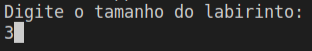
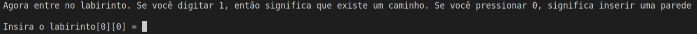
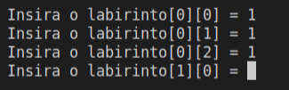
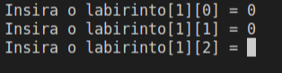
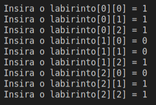
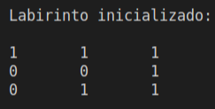
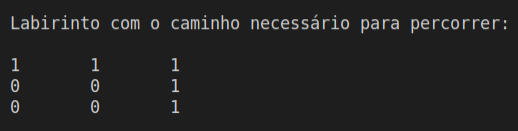

# Labirinto-Heurístico

<div style="display: inline-block;">

 
</a> 
</div>

<p> </p>
<p> </p>

## Grupo
- Celso Vinícius S. F.
- Pedro H. Pires Dias

## Abstract

Programa sobre o caminhamento em labirinto. Deve contemplar as modificações necessárias do BFS para torna-lo um algoritmo heurístico, chamado A*.

A. Entregar a codificação devidamente elaborada sob o modelo de execução estabelecido, bem como, a comparação do algoritmo A* para as heurísticas euclidiâna e manhattan;

B. Um relatório contemplando uma discussão comparativa entre BFS, DFS e A*. Espera-se que este documento apresente fatores comparativos de velocidade de execução e quantidade de passos para a finalização do labirinto. Além disso, espera-se que aprofunde em uma apresentação adequada do modelo de funcionamento de cada um e os motivos que tornam uma das soluções a melhor opção.

## Estrutura BFS Search
BFS significa Breadth First Search. É uma técnica baseada em vértices para encontrar o caminho mais curto no gráfico. Ele usa uma estrutura de dados Fila que segue primeiro a entrar, primeiro a sair. No BFS, um vértice é selecionado no momento em que é visitado e marcado, então seus adjacentes são visitados e armazenados na fila. É mais lento que o DFS. 

## Estrutura DFS Search
DFS significa Depth First Search. É uma técnica baseada em borda. Ele usa a estrutura de dados Pilha, executa dois estágios, primeiro os vértices visitados são colocados na pilha e, em segundo lugar, se não houver vértices, os vértices visitados são removidos. 

## Algoritmo A*

O algoritmo A* é um dos mais utilizados em situações de pathfinding, ou busca de caminhos.

Ele utiliza uma estrutura de dados chamada Fila para organizar os vértices que serão explorados;

Além de salvar os caminhos já calculados, ele também utiliza heurísticas para estimar em cada ponto quanto ainda falta para o final, buscando direcionar a escolha do próximo vértice.

A ideia do algoritmo é tentar acertar o menor caminho o mais rápido possível! Por isso ele olha tanto para o passado (o quanto ele já percorreu) como para o futuro (o quanto ainda falta) na hora de estimar se um caminho é bom ou não. Não quer dizer que ele acerta de primeira, mas ele converge para o menor caminho muito mais rápida e precisamente do que as buscas por DFS e BFS conseguem fazer. De certa forma, esse algoritmo é uma combinação desses tipos de busca utilizando o que há de melhor em cada um dos métodos.
Por convergir mais rápido, o algoritmo A* acaba explorando menos vértices para achar a solução, e consequentemente possui uma performance melhor. Se você não usar nenhuma heurística para mensurar o caminho para a frente do vértice atual, estará olhando apenas o caminho já percorrido.

## Heurística Euclidiâna

Utiliza-se o teorema de Pitágoras para descobrir qual seria a distância em linha reta do ponto do labirinto até o ponto de destino. Essa heurística é mais utilizada quando se tem um mapa contínuo, que não segue o padrão do grid, e onde os custos de movimentação podem ser mais variados:

Distância = RAIZ_QUADRADA (|posição_atual.x - destino.x|² + |posição atual.y - destino.y|²)

## Heurísticas Manhattan

O movimento só pode ser realizado nas quatro direções. Na distância de Manhattan, o cálculo do valor da heurística seria a soma de quantos blocos faltam, na vertical e na horizontal, para chegar ao objetivo. Logo a distância de cada bloco para o objetivo seria dada por:

Distância = |posição_atual.x - destino.x| + |posição_atual.y - destino.y|

## Método PrintMaze
<p align="justify">
Nesse método imprime a primeira pesquisa por DFS.
</p>

```c
// imprimir a primeira DFS
void PrintMaze(int** sol, int N){
    for (int i = 0; i < N; i++){
        for (int j = 0; j < N; j++){
            cout << sol[i][j] << "\t";
        }
        cout << endl;
    }
}
```

## Método CheckPath
<p align="justify">
Nesse método verifica se o labirinto está com caminho livre ou não ou se há final.
</p>

```c
bool CheckPath(int** maze, int N, int x, int y){
    // se (x, y fora do labirinto) retorna falso
    if (x >= 0 && x < N && y >= 0 && y < N && maze[x][y] == 1)
        return true;
    return false;
}  
```


## Método solveMaze
<p align="justify">
Nesse método verifica se uma solução existe ou não e se é uma solução. Define o caminho da solução e imprime o labirinto desejado com o caminho necessário.
</p>

```c
bool solveMaze(int** maze, int N){
    int M;
    M = N;
    int** sol = new int* [M];
    for (int i = 0; i < M; ++i){
        sol[i] = new int[M];
    }
    for (int i = 0; i < N; i++){
        for (int j = 0; j < N; j++){
            sol[i][j] = 0;
        }
    }
    if (SolutionPath(maze, N, 0, 0, sol) == false){
        cout << "Solução não existe";
        return false;
    }
    PrintMaze(sol, N);
    return true;
}  
```

## Método SolutionPath
<p align="justify">
Nesse método resolve o problema do labirinto usando os métodos CheckPath e Solution.
</p>

```c
bool SolutionPath(int** maze, int N, int a, int y, int** sol){
    if (a == N - 1 && y == N - 1 && maze[a][y] == 1) {
        sol[a][y] = 1;
        return true;
    }
    if (CheckPath(maze, N, a, y) == true){
        if (sol[a][y] == 1)
            return false;
        sol[a][y] = 1;
        if (SolutionPath(maze, N, a + 1, y, sol) == true)
            return true;
        if (SolutionPath(maze, N, a, y + 1, sol) == true)
            return true;
        sol[a][y] = 0;
        return false;
    }
    return false;
}         
```


## Funcionamento do programa

<p align="justify">	
	Inicialmente o usuário insere o tamanho do labirinto, sendo este no formato NxN.
  </p>
    <p align="center">
     
  </p>
  
  Em seguida o usuário ''entra'' no labirinto, e é aí onde insere as paredes e os possíveis caminhos para percorrer. 
  </p>
    <p align="center">
     
  </p>
  
  Ao digitar o número '1', o programa lê como um caminho possível a ser percorrido.
  </p>
    <p align="center">
     
  </p>
  
  Caso seja digitado o número '0', o programa entende que têm uma parede nesse local.
  </p>
    <p align="center">
     
  </p>
  
  
  Todos os caminhos e paredes inseridos neste exemplo:
  </p>
    <p align="center">
     
  </p>
  
  Após inserido o labirinto conforme o usuário desejar, é impresso o labirinto digitado.
  </p>
    <p align="center">
     
  </p>
  
  Por fim, é impresso o caminho percorrido pelo programa.
  </p>
    <p align="center">
     
  </p>
  
## Compilação e Execução

O código disponibilizado possui um arquivo Makefile que realiza todo o procedimento de compilação e execução. Para tanto, temos as seguintes diretrizes de execução:


| Comando                |  Função                                                                                           |                     
| -----------------------| ------------------------------------------------------------------------------------------------- |
|  `make clean`          | Apaga a última compilação realizada contida na pasta build                                        |
|  `make`                | Executa a compilação do programa utilizando o gcc, e o resultado vai para a pasta build           |
|  `make run`            | Executa o programa da pasta build após a realização da compilação                                 |


